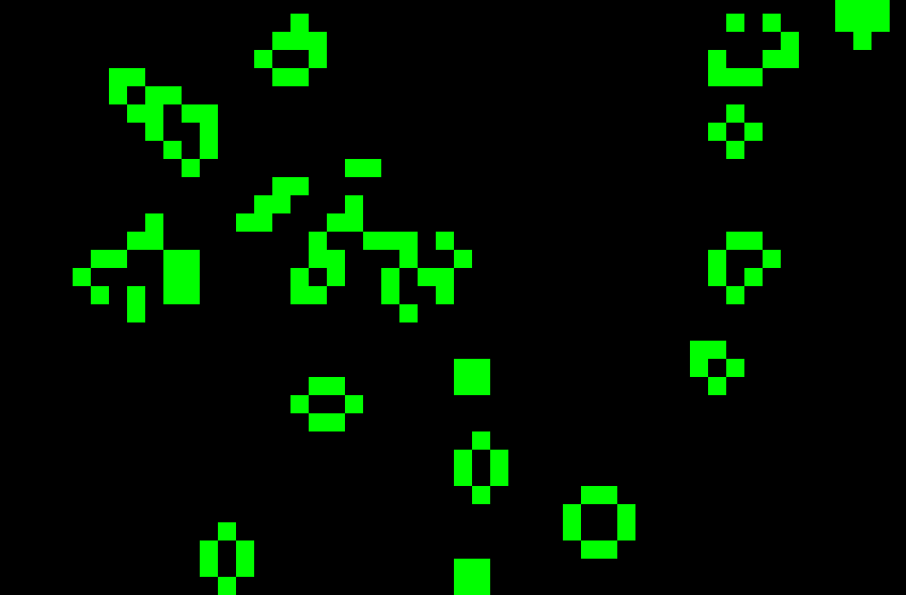
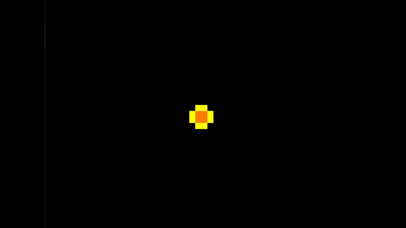

<h1>Neplo's Cellular Automata</h1>

<h3>A collection of my personal experiments on Cell Simulations through Rust</h3>

#### **Key Features**

- Built in Graphical Rendering through Vello.
    - Zooming through Mouse Wheel.
    - Panning with left-click.
- Terminal Rendering as backup.
- Terminal Statistics on cell deaths and births.

#### **Supported Rulesets**

- Conway's Game of Life
    - The OG.
    - Lots of different patterns/shapes that pop up.
- Life Without Death
    - Ends quickly on a random matrix.
    - Concept of laddering exists where cells branch out in a direction until they hit another ladder.
- Seeds
    - Seems to run in perpetuity when starting on a dense board.
    - Difficult for patterns to pop up by random chance.
- Brian's Brain
    - One of the most famous multi-state Cellular Automata Rulesets.
    - Allows for beautiful cascading patterns that expand forever until they hit a wall.

#### **Roadmap**

- GUI is still shakey and needs work.
- I also want to add statistical info to the GUI with time.
- Explore New Rulesets.
    - Day and Night (Symmetric)

#### **Notes/Questions About CA**

- Does the existence of Cellular Automata imply that even if events are deterministic, free will can still exist? I.E. We know that by the rules of Conway's Game of life, a set amount of things will always happen. Although this is true, random situations continue to happen. If this holds true for our cellular simulation, does it also hold true for our universe?
- Does the existence of Cellular Automata strengthen the claim that we might be living in a massive simulation?

#### **Resources**

- [CA Ruleset Dictionary](https://web.archive.org/web/20090210151850/http://psoup.math.wisc.edu/mcell/rullex_life.html)
- [Wikipedia CA Ruleset Dictionary](https://en.wikipedia.org/wiki/Category:Cellular_automaton_rules)
- [LifeWiki](https://conwaylife.com/wiki/)

#### **Photos**

